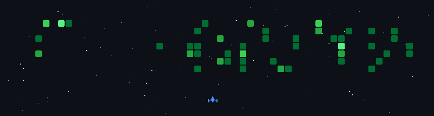

# Hi, I'm Akif 👋

CSE undergrad at Sri Ramakrishna Engineering College, Coimbatore — worked at **Nexoris Solutions** and co-founding **Araskova Labs**, the parent company behind **AI08**, a digital agency I run doing software, AI, and marketing work for clients.

🔗 [muhammadakif.in](https://muhammadakif.in/) · [araskova.com](https://www.araskova.com/) · [ai08.in](https://ai08.in/)

---

### 🚧 What I'm building

- **VR-TEX** — an Electron ERP for a textile manufacturing business, built with React, TypeScript, and SQLite; handles vendor/production ledgers, multi-variety stock tracking, and role-based access
- **BillBridge** — an OCR-powered billing compliance platform (FastAPI + React), extracting and validating tax fields (GSTIN, PAN, IRN, HSN) from invoices with paise-level precision
- **Gola KP** — a Vedic astrology app (FastAPI + React Native + Swiss Ephemeris) with a conversational input UI and a KP-style chart wheel
- **Sentinel** — an AI-powered verification system for coursework/hackathon submissions
- **FocusBot** — an ESP32-S3 desk assistant that detects distraction and nudges focus, written up as an IEEE conference paper

---

### 💻 Tech Stack

      

    

   

   

  

---

### 📊 GitHub Stats

 
 

---

<!-- Proudly created with GPRM ( https://gprm.itsvg.in ) -->
